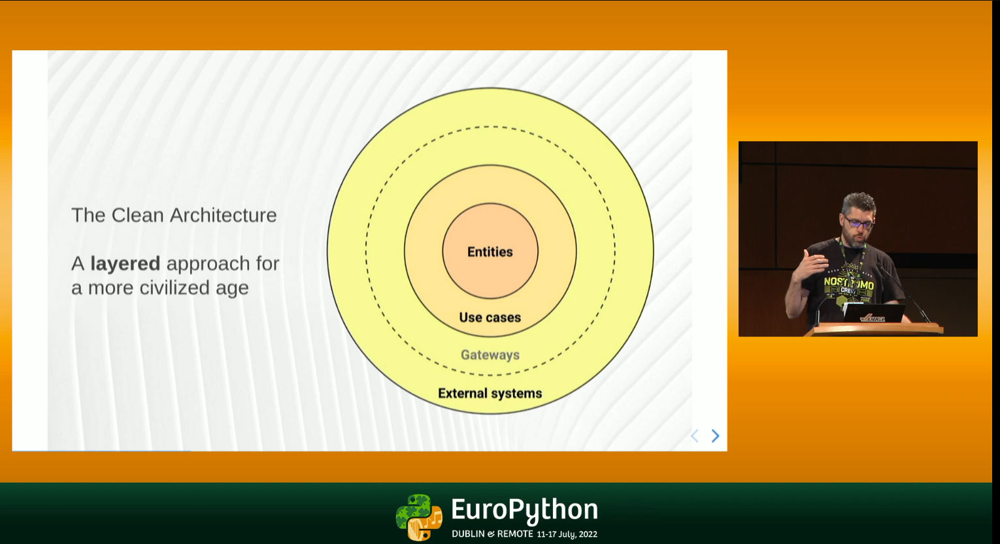

# Lectii

[Слоистая Архитектура на FastAPI / Onion Architecture](https://www.youtube.com/watch?v=8Im74b55vFc)

Наглядная реализация паттерна Репозиторий и принципов внедрения зависимостей

---

[Clean Architectures in Python - presented by Leonardo Giordani](https://www.youtube.com/watch?v=C7MRkqP5NRI)

EuroPython 2022 - Clean Architectures in Python - presented by Leonardo Giordani
