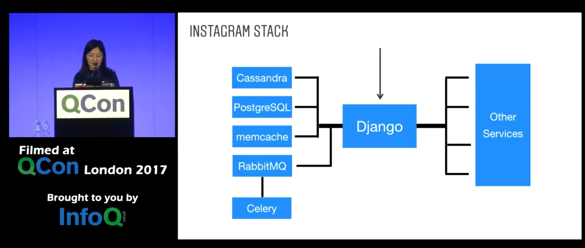

[ Scaling Instagram Infrastructure ](https://www.youtube.com/watch?v=hnpzNAPiC0E)

Lisa Guo overviews Instagram's infrastructure, its history, multi-data center support, tuning uwsgi parameters for scaling, performance monitoring and diagnosis, and Django/Python upgrade.